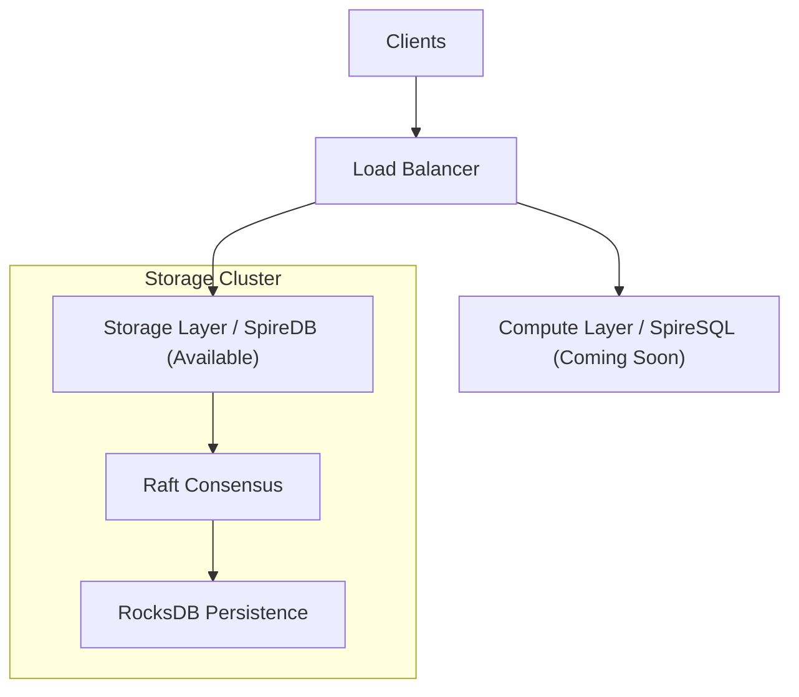

<p align="center">
  
</p>

<h1 align="center">SpireDB</h1>
<p align="center">
  <b>Stream -> Store -> Scale.</b>
</p>

<p align="center">
  <a href="https://opensource.org/licenses/MIT"></a>
  <a href="https://elixir-lang.org"></a>
  <a href="https://redis.io/docs/reference/protocol-spec/"></a>
  <a href="https://discord.gg/6GtdpFpU8F"></a>
  <a href="https://ghcr.io/spiredb/spiredb"></a>
</p>

<br>

SpireDB is building a unified data platform that seamlessly integrates high-performance distributed storage with intelligent compute capabilities.

Currently shipping: **SpireDB** — The foundational storage engine.
- **Protocol**: RESP (Redis-compatible) & Internal gRPC High-Performance Tier.
- **Consistency**: Raft-based distributed consensus.
- **Performance**: Local-First Write architecture with Asynchronous Replication.
- **Backing**: RocksDB for durable, low-latency persistence.

*Coming Soon: **SpireSQL** — The scalable compute and query layer.*

---

## Quick Start

Get the storage engine running in seconds using our production-ready Docker image.

### Run with Docker

```bash
docker run -d \
  --name spiredb \
  -p 6379:6379 \
  -v spiredb_data:/var/lib/spiredb \
  ghcr.io/spiredb/spiredb:latest
```

### Connect

Use any Redis-compatible client to interact with the storage layer:

```bash
redis-cli -p 6379 SET greeting "Hello SpireDB"
# "OK"
redis-cli -p 6379 GET greeting
# "Hello SpireDB"
```

---

## Architecture

The SpireDB platform is designed as a layered distributed system:



### Core Technologies
- **Elixir/OTP**: For massive concurrency and fault tolerance.
- **Ra**: Reliable implementation of the Raft consensus algorithm.
- **RocksDB**: Industry-standard embedded storage engine.
- **NIF Optimization**: Direct native access to storage for zero-latency operations.

---

## Configuration

Control the storage node via environment variables:

| Variable | Description | Default |
|----------|-------------|---------|
| `SPIRE_RESP_PORT` | TCP port for client connections | `6379` |
| `SPIRE_ROCKSDB_PATH` | Persistent data location | `/var/lib/spiredb/data` |
| `SPIRE_RAFT_DATA_DIR` | Raft log location | `/var/lib/spiredb/raft` |
| `SPIRE_LOG_LEVEL` | Log verbosity | `info` |

## Development

To contribute to the SpireDB Core:

```bash
# Clone the repository
git clone https://github.com/spiredb/spiredb.git
cd spiredb

# Setup dependencies
make setup

# Run tests
make test

# Start local cluster
make run
```
